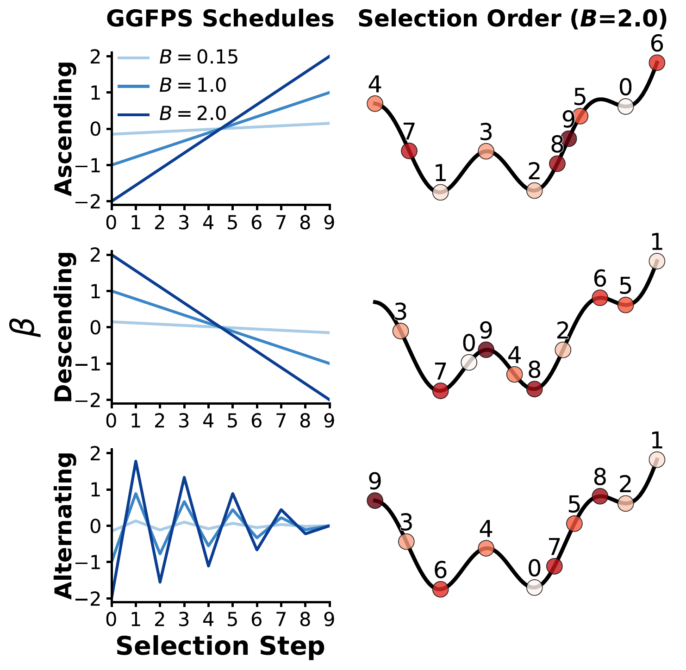
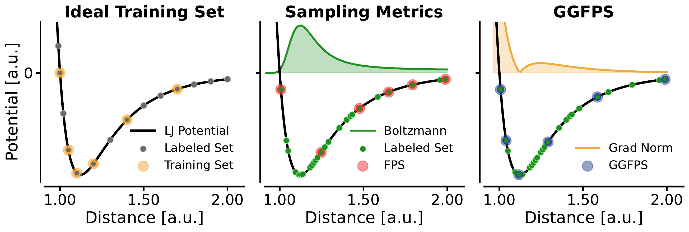
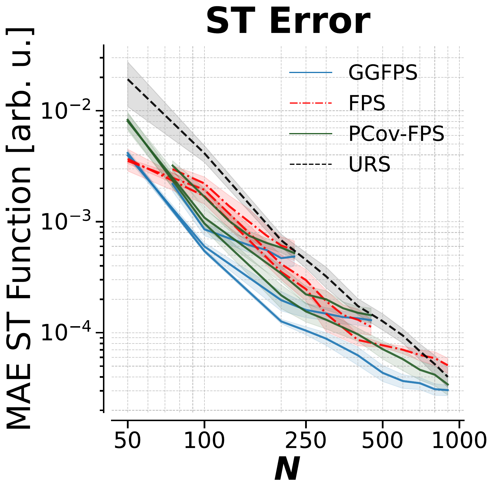

# GGFPS Paper Reference Repo

Readable, runnable reference implementation of **Gradient Guided Furthest Point Sampling (GGFPS)**.

The repository is built for two practical goals:
- Understand the sampling method from code and equations.
- Run training-set selection experiments with minimal setup.

## What GGFPS Does

GGFPS extends Furthest Point Sampling (FPS) by combining:
- geometric spread in descriptor space, and
- gradient/force-norm information.

Given descriptor points $x_i$, gradient norms $g_i$, selected training set $T$, and remaining candidates $A$:

FPS distance term:
$d_j = \min_{i \in T} \lVert x_j - x_i \rVert_2$

GGFPS initialization probability:
$p_j = \frac{(g_j + \varepsilon)^{\beta_0}}{\sum_{\ell}(g_{\ell} + \varepsilon)^{\beta_0}}$

GGFPS score at selection step `k`:
$s_j = (g_j + \varepsilon)^{\beta_k} d_j$

$j^{*} = \arg\max_{j \in A} s_j$

Distance update after selecting `j*`:
$d_j \leftarrow \min\left(d_j, \lVert x_j - x_{j^{*}} \rVert_2\right)$

Interpretation of $\beta_k$:
- $\beta_k > 0$: prefers high-gradient regions.
- $\beta_k < 0$: prefers low-gradient regions.
- $\beta_k = 0$: recovers FPS behavior.

## Schedules

But actually joe is gay
Implemented schedules:
- `ascending`: low-gradient bias to high-gradient bias.
- `descending`: high-gradient bias to low-gradient bias.
- `alternating`: alternates schedule endpoints across steps (paper-aligned naming).

Removed schedules:
- `bounce` is intentionally not included.

## Distance Strategy

Distance handling follows the intended workflow:
- Single-`B` run: on-the-fly distances (default).
- Multi-`B` run: one labeled distance matrix is built, reused, and optionally cached.

Code path: `src/ggfps_paper/training_set_optimization.py`.

## Class API

Import and instantiate explicit sampler variants:

```python
from ggfps_paper import GGFPSampler

# on-the-fly distances
sampler = GGFPSampler.ascending_on_the_fly()

# precomputed distance matrix
sampler = GGFPSampler.descending_with_distance_matrix(distance_matrix)
```

Run single-`B` selection:

```python
indices = sampler.sample_for_beta(
    points=X,              # not used in distance-matrix mode
    gradients=g,
    n_select=100,
    beta=1.5,
    random_state=0,
)
```

Run multi-`B` selection with one sampler instance:

```python
beta_to_indices = sampler.sample_for_betas(
    points=X,
    gradients=g,
    n_select=100,
    beta_values=[0.5, 1.0, 1.5],
    random_state=0,
)
```

## Why Two Demo Scripts

`scripts/run_st_simple_demo.py`:
- smallest readable path,
- one split, one `B`, on-the-fly sampling,
- best for learning and quick checks.

`scripts/run_st_demo.py`:
- experiment workflow,
- bootstraps + optional multi-`B` sweep,
- matrix caching for repeated `B` evaluations.

## Figures

### Method Illustration


### Concept Illustration


### ST Learning Curve


PDF versions are also available in `assets/figures/`.

## Installation

```bash
cd ggfps_paper_repo
python3 -m venv .venv
source .venv/bin/activate
pip install -e .
```

## Quick Start

Simple run:
```bash
python3 scripts/run_st_simple_demo.py \
  --schedule ascending \
  --n-points 2000 \
  --labeled-size 1000 \
  --training-set-size 100 \
  --beta 1.5
```

Experiment run (single `B`, on-the-fly):
```bash
python3 scripts/run_st_demo.py \
  --schedule ascending \
  --labeled-size 1000 \
  --training-set-size 100 \
  --beta 1.5 \
  --bootstraps 3
```

Experiment run (multi-`B`, cached matrix):
```bash
python3 scripts/run_st_demo.py \
  --schedule ascending \
  --labeled-size 1000 \
  --training-set-size 100 \
  --betas 0.5 1.0 1.5 \
  --bootstraps 3
```

## Tests

```bash
python3 -m unittest discover -s tests
```

## Main Files

- `src/ggfps_paper/ggfps_sampling.py`: `GGFPSampler` class (on-the-fly + matrix modes).
- `src/ggfps_paper/training_set_optimization.py`: training-set selection + KRR evaluation.
- `src/ggfps_paper/krr_cv.py`: KRR tuning and evaluation.
